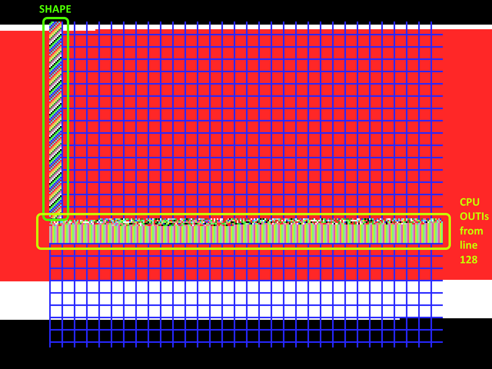
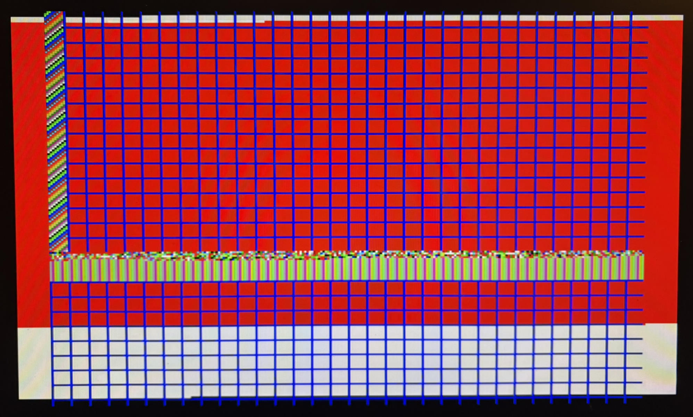

# MSX CMD Timings

This utility shows, in a _rough manner_, a slowdown effect on the command engine operations found in Yamaha V9938 VDPs (and successors) when the CPU are writing to VRAM at the same time as the command is executing.

I wrote this utility to see which parameters that affect the result. This research stems from a discussion in a [thread](https://www.msx.org/forum/msx-talk/development/triple-buffer-vs-line-split-doubt?page=2) on [MRC](https://msx.org) and the great [VDP timings paper](https://map.grauw.nl/articles/vdp-vram-timing/vdp-timing.html) by Wouter Vermaelen. Maybe one day we can have a rough formula to calculate the gain/loss when using paralellized VDP and CPU->VDP work? As a next step to the [numbers by Grauw](https://map.grauw.nl/articles/vdp_commands_speed.php#speedtests) in his article.

You need to know how the [CRT raster beam](https://en.wikipedia.org/wiki/Raster_scan) works to read the output.

### Product
* A 16 kB ROM file for MSX2 VDPs and above
* ASCII-16 mapper
* ROM file can be found here: `project/Debug/bin/cmd_cpu.rom`

## How it looks and works

 
 

Key takeaway in the image above: __THE SIZE OF THE WHITE BAR__.

The screen above shows:
* NTSC/60Hz, screen 5, 256x212, page 0, _Sprites_ ON (but none visible)
* Emulated in openMSX 21.0-89 Sony_HB-F1XDJ. Real footage is from a Panasonic FS-A1.
* A simple grid so we can do simple visual comparisons with real hardware
* CPU is idle from VBLANK until line 0, after that:
* Command engine kicks off a BLOCK COPY from PAGE 1 (at 0,0 in this example)
  * Marked with green outline in the image
  * Pixel count is "Small" - 8 * 128 pixels = 1024 (=512 bytes)
  * The _shape_ of the copy is "portrait"
  * The _copy mode_ is "Logical" (LMMM - slow) and the _logical operation_ is IMP
  * The border is set to __WHITE__ at this point
* The CPU starts _pushing_ 2048 unrolled OUTIs to VRAM at line 128 and onwards (18 * 2048 = cycles). Data is just random data.
  * Marked with yellow outline in the image
  * The border is set to __RED__ at this point
* Once CPU is done the border will show __WHITE__ again until the BLOCK COPY is finished.
  * Border is __BLACK__ when CPU is idle again.
* BIOS is not used during operation (only change of screen mode), and the interrupt code at 0x0038 is minimal
* All this is repeated for every frame

### Key mappings during execution

| Area        | Key        | Description |
| ----------- | ---------- | ----------- |
| Shape       | F1         | Landscape (default) |
|             | F2         | Portrait      |
|             | F3         | Square      |
|             | F4         | Square with odd x destination, splitting bytes and nibbles |
|             | F5         | Square placed at line 126, i.e copy crosses 0x4000 boundary (normal VRAM adressing must update vdp#14 for this) |
| Sprites     | RET        | ON (default)     |
|             | ESC        | OFF     |
| Copy mode   | ⬅ (left)  | FAST or HMMM, working on byte level (default) |
|             | ➡  (right)| SLOW or LMMM, logical operations allowed      |
| CPU push    | ⬆ (up)     | ON (default)    |
|             | ⬇ (down)   | OFF      |
| Logical operation  | 0          | IMP (default)     |
|             | 1          | AND      |
|             | 2          | OR      |
|             | 3          | EOR (XOR)      |
|             | 4          | TIMP      |
|             | 5          | TAND      |
|             | 6          | TOR      |
|             | 7          | TEOR (TXOR)      |
| Screen      | C          | Screen 5 (default)     |
|             | D          | Screen 8      |

* The keyboard mapping is not working for _numbers_ on Russian keyboards as I do not use BIOS for this, but the ports directly.

## KNOWN BUG
__DO NOT SWAP BETWEEN SCREEN MODES WHEN LMMM AND CPU-PUSH IS ENABLED, THE SCREEN FREEZES. I'LL FIX SOON...__

### Hidden functionality
Clearly, the command engine's capacity is mainly bound by bytes and not pixels, so the amount of pixels are ~doubled in the case of HMMM (fast copy) and screen 5.

### Questions I had...
* Does CPU->VRAM push during command operation affect the command execution time(as described in Wouter's paper)? YES
* Does the shape of the block affect the execution time (as described in Wouter's paper)? YES
* Does sprites ON/OFF affect the execution time (as described in Wouter's paper)? YES
* Does the kind of logical operation used (in "slow" mode) affect the execution time? NO
* Does the splitting nibbles across bytes from src to dest in logical copy affect the execution time? NO
* Does the clopy block crossing the 0x4000 boundary affect the execution time? NO
* Does the placement of the destination image affect the execution time? NO
* Does screen mode affect the execution time? YES if you look at pixel amount, NO if you look at byte amount
* Are these timings perfectly emulated in emulators? NO (openMSX seems to be correct in HMMM, but not at LMMM)

## Requirements for building

Written in asm but also a lot of C for simplicity.

* SDCC (I use v4.5)
* python (I use 3.11)
* Glass assembler (is assumed to be found in the root dir)

### Build notes
I just tossed this project together, so there are a lot of build scripts from my pipeline included which does not necessarily need to be there. I use __Windows__, so there are `bat`-files and some powershell commands for building symbol files and such (but these are not required for building). The `run`-file references __openMSX__, but other emulators can be used ofc. The VS code files are there too. For my own personal convenience &#128515;
